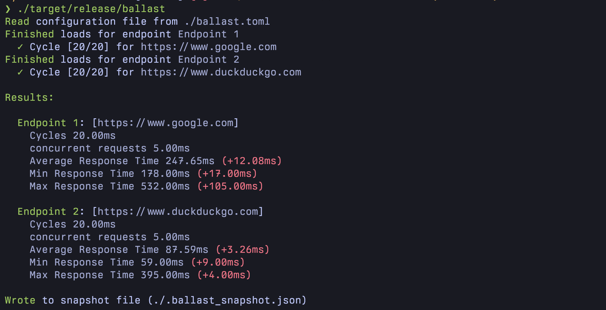

Ballast
==========================

A simple cli tool, that lets you define load tests for your api's, run them iteratively and compare results.

## Details

- Define a ballast.toml file at the root of your project
  Here you can define what endpoint you want to test. 

```toml
[[endpoints]]
name = "Endpoint 1"
url = "https://www.google.com"
method = "GET"
concurrent_requests = 10
cycles = 20
headers = {"Content Type": "application/json"}
body = "{\"input\": \"Hello World\"}"
expected_status = 200
```

- run `ballast` in the directory with the ballast.toml


Ballast will run your configured load tests from the config and save the results in a snapshot file.
The next time you run the load test, you can compare different performance metrics of your api.

